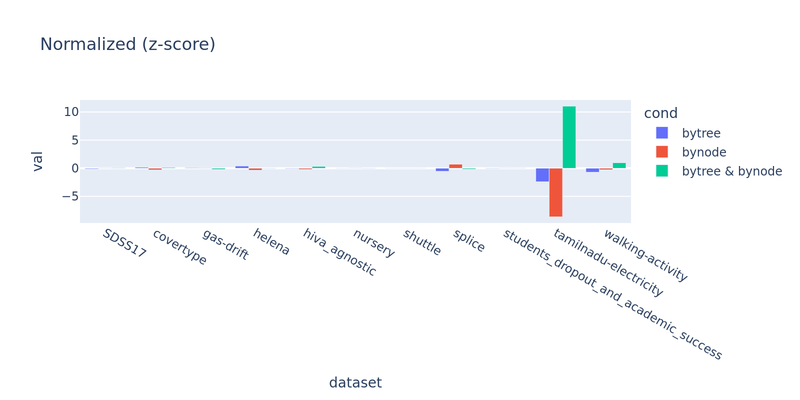

# Script

```bash
nohup python ../tests/train_dataset.py \
    --mode lgb --trial 50 --jobs 30 --random_seed 1 --nloop 2 --nfold 3 --ncv 5 --filepath params_colsample_bytree.db \
    --iter 1000 --learning_rate 0.1 --num_leaves 256 --max_depth -1 --min_child_samples 5 \
    --colsample_bytree 1 --colsample_bylevel 1 --colsample_bynode 1 --max_bin 128 --reg_alpha 0 \
    --tunings min_child_weight,reg_lambda,colsample_bytree,subsample \
    --dataset SDSS17,covertype,gas-drift,helena,hiva_agnostic,nursery,shuttle,splice,students_dropout_and_academic_success,tamilnadu-electricity,walking-activity \
    > nohup_params_colsample_bytree.out &

nohup python ../tests/train_dataset.py \
    --mode lgb --trial 50 --jobs 30 --random_seed 1 --nloop 2 --nfold 3 --ncv 5 --filepath params_colsample_bynode.db \
    --iter 1000 --learning_rate 0.1 --num_leaves 256 --max_depth -1 --min_child_samples 5 \
    --colsample_bytree 1 --colsample_bylevel 1 --colsample_bynode 1 --max_bin 128 --reg_alpha 0 \
    --tunings min_child_weight,reg_lambda,colsample_bynode,subsample \
    --dataset SDSS17,covertype,gas-drift,helena,hiva_agnostic,nursery,shuttle,splice,students_dropout_and_academic_success,tamilnadu-electricity,walking-activity \
    > nohup_params_colsample_bynode.out &

nohup python ../tests/train_dataset.py \
    --mode lgb --trial 50 --jobs 60 --random_seed 1 --nloop 2 --nfold 3 --ncv 5 --filepath params_colsample_both.db \
    --iter 1000 --learning_rate 0.1 --num_leaves 256 --max_depth -1 --min_child_samples 5 \
    --colsample_bytree 1 --colsample_bylevel 1 --colsample_bynode 1 --max_bin 128 --reg_alpha 0 \
    --tunings min_child_weight,reg_lambda,colsample_bytree,colsample_bynode,subsample \
    --dataset SDSS17,covertype,gas-drift,helena,hiva_agnostic,nursery,shuttle,splice,students_dropout_and_academic_success,tamilnadu-electricity,walking-activity \
    > nohup_params_colsample_both.out &

nohup python ../tests/train_dataset.py \
    --mode lgb --trial 0 --jobs 60 --random_seed 1 --nloop 5 --nfold 3 --ncv 5 --filepath baseline \
    --iter 2000 --learning_rate 0.2 --num_leaves 256 --max_depth -1 --min_child_samples 5 \
    --colsample_bytree 1 --colsample_bylevel 1 --colsample_bynode 1 --max_bin 128 --reg_alpha 0 --is_extratree \
    --dataset SDSS17,covertype,gas-drift,helena,hiva_agnostic,nursery,shuttle,splice,students_dropout_and_academic_success,tamilnadu-electricity,walking-activity \
    > nohup_baseline.out &
```

```bash
python -i -c "
import pandas as pd
import numpy as np
df1    = pd.read_csv('./params_colsample_bytree.db.lgb.csv', encoding='utf-8')
df2    = pd.read_csv('./params_colsample_bynode.db.lgb.csv', encoding='utf-8')
df3    = pd.read_csv('./params_colsample_both.db.lgb.csv',   encoding='utf-8')
dfbase = pd.read_csv('./baseline.lgb.csv',                   encoding='utf-8')
dfmean = pd.concat([df1, df2, df3], axis=0, ignore_index=True)
df1    = df1.loc[df1['is_ensemble']].groupby('dataset')['eval'].agg(['mean', 'std']).reset_index(drop=False).rename(columns={'mean': 'm_tree', 'std': 's_tree'})
df2    = df2.loc[df2['is_ensemble']].groupby('dataset')['eval'].agg(['mean', 'std']).reset_index(drop=False).rename(columns={'mean': 'm_node', 'std': 's_node'})
df3    = df3.loc[df3['is_ensemble']].groupby('dataset')['eval'].agg(['mean', 'std']).reset_index(drop=False).rename(columns={'mean': 'm_both', 'std': 's_both'})
dfbase = dfbase.loc[dfbase['is_ensemble']].groupby('dataset')['eval'].std(). reset_index(drop=False).rename(columns={'eval': 's_base'})
dfmean = dfmean.loc[dfmean['is_ensemble']].groupby('dataset')['eval'].mean().reset_index(drop=False).rename(columns={'eval': 'm_base'})
df     = pd.merge(pd.merge(pd.merge(df1, df2, how='left', on='dataset'), df3, how='left', on='dataset'), pd.merge(dfmean, dfbase, how='left', on='dataset'), how='left', on='dataset')
df['n_tree'] = (df['m_tree'] - df['m_base']) / df['s_base']
df['n_node'] = (df['m_node'] - df['m_base']) / df['s_base']
df['n_both'] = (df['m_both'] - df['m_base']) / df['s_base']
df['r_n_t']  = np.log(df['m_node'] / df['m_tree'])
df['r_n_b']  = np.log(df['m_node'] / df['m_both'])
df['r_t_b']  = np.log(df['m_tree'] / df['m_both'])

# plot
import plotly.express as px
df_n = df.melt(id_vars='dataset', value_vars=['n_tree', 'n_node', 'n_both'], var_name='cond', value_name='val')
df_r = df.melt(id_vars='dataset', value_vars=['r_n_t', 'r_n_b', 'r_t_b'], var_name='cond', value_name='val')
df_n['cond'] = df_n['cond'].replace({'n_tree': 'bytree', 'n_node': 'bynode', 'n_both': 'bytree & bynode'})
df_r['cond'] = df_r['cond'].replace({'r_n_t': 'bynode / bytree', 'r_n_b': 'bynode / (bytree & bynode)', 'r_t_b': 'bytree / (bytree & bynode)'})
fig1 = px.bar(df_n, x='dataset', y='val', color='cond', barmode='group', title='Normalized (z-score)')
fig1.update_layout(height=400, width=800)
fig1.write_image('colsample_zscore.png', scale=2)
fig2 = px.bar(df_r, x='dataset', y='val', color='cond', barmode='group', title='Log Ratio')
fig2.update_layout(height=400, width=800)
fig2.write_image('colsample_logratio.png', scale=2)

# print
print(df[['n_tree', 'n_node', 'n_both', 'r_n_t', 'r_n_b', 'r_t_b']].mean())
print(df[['dataset', 'm_tree', 'm_node', 'm_both', 'm_base', 's_base', 'n_tree', 'n_node', 'n_both', 'r_n_t', 'r_n_b','r_t_b']].to_markdown(index=False))
```

# Result




```python
標準化 bytree          -0.298569
標準化 bynode          -0.804466
標準化 bytree & bynode  1.103035
log比 bynode / bytree             0.038951
log比 bynode / (bynode & bytree)  0.047077
log比 bytree / (bynode & bytree)  0.008125
```

- A: `common parameter` + `feature_fraction` をチューニングし best model で評価
- B: `common parameter` + `feature_fraction_bynode` をチューニングし best model で評価
- C: `common parameter` + `feature_fraction` & `feature_fraction_bynode` をチューニングし best model で評価

| dataset                               |      平均_A |      平均_B |      平均_C |      ABC平均 |   extra_tree評価値分散    |      標準化_A |     標準化_B |     標準化_C |     log(B/A) |   log(B/C) |  log(A/C) |
|:--------------------------------------|------------:|------------:|------------:|------------:|------------:|------------:|------------:|------------:|-------------:|-------------:|-------------:|
| SDSS17                                | 0.0740802   | 0.0744852   | 0.0746289   | 0.0743981   | 0.00237945  | -0.133603   |  0.0365945  |  0.0970089  |  0.00545186  | -0.0019281   | -0.00737996  |
| covertype                             | 0.0840811   | 0.0817237   | 0.0839117   | 0.0832388   | 0.00503774  |  0.167192   | -0.300758   |  0.133566   | -0.0284379   | -0.0264211   |  0.00201673  |
| gas-drift                             | 0.0291754   | 0.0291252   | 0.0276443   | 0.0286483   | 0.00476336  |  0.11065    |  0.100131   | -0.210781   | -0.00171901  |  0.0521871   |  0.0539061   |
| helena                                | 2.63883     | 2.62758     | 2.63218     | 2.63286     | 0.0150716   |  0.395712   | -0.3503     | -0.0454124  | -0.00426993  | -0.00174728  |  0.00252265  |
| hiva_agnostic                         | 0.18721     | 0.186659    | 0.18941     | 0.18776     | 0.00521162  | -0.105413   | -0.211297   |  0.316711   | -0.00295198  | -0.0146347   | -0.0116827   |
| nursery                               | 0.00133429  | 0.00174878  | 0.0011652   | 0.00141609  | 0.00715337  | -0.0114349  |  0.0465081  | -0.0350731  |  0.270518    |  0.406026    |  0.135509    |
| shuttle                               | 0.000402254 | 0.000404696 | 0.000405506 | 0.000404152 | 0.000424648 | -0.00446887 |  0.00128098 |  0.00318789 |  0.0060516   | -0.00199893  | -0.00805053  |
| splice                                | 0.102394    | 0.122131    | 0.108331    | 0.110952    | 0.0156164   | -0.54799    |  0.715838   | -0.167847   |  0.176261    |  0.119903    | -0.0563581   |
| students_dropout_and_academic_success | 0.568858    | 0.570679    | 0.570596    | 0.570044    | 0.0209764   | -0.0565532  |  0.0302459  |  0.0263072  |  0.00319558  |  0.000144786 | -0.00305079  |
| tamilnadu-electricity                 | 2.99454     | 2.994       | 2.9957      | 2.99474     | 8.66048e-05 | -2.39791    | -8.64491    | 11.0428     | -0.000180685 | -0.000569328 | -0.000388643 |
| walking-activity                      | 0.998832    | 1.00338     | 1.01663     | 1.00628     | 0.0106384   | -0.70044    | -0.272459   |  0.972898   |  0.00454802  | -0.0131176   | -0.0176656   |
