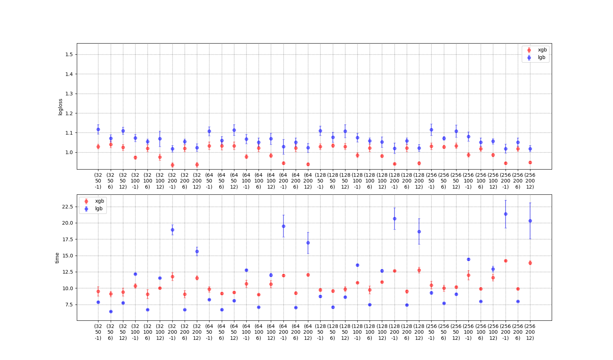
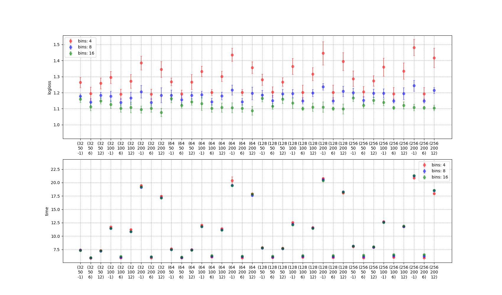

# Test

### Classification LGBM

```
2025-01-17 20:12:56,710 - __main__ - <module> - INFO : {
  "multiclass_log": 0.9545656722927647,
  "multiclass_acc": 0.9422992521707702,
  "CategoryCE_log": 0.9585106507952086,
  "CategoryCE_acc": 0.9500873471425006,
  "FocalLoss_log": 0.820885602302204,
  "FocalLoss_acc": 0.9585552868686695,
  "LogitMarginL1Loss_log": 0.8967390932259446,
  "LogitMarginL1Loss_acc": 0.9441322513188127,
  "CrossEntropyLoss_log": 0.8213802464580792,
  "CrossEntropyLoss_acc": 0.9711453232704835,
  "BinaryCrossEntropyLoss_log": 0.7292651048159128,
  "BinaryCrossEntropyLoss_acc": 0.9707236474101357,
  "CrossEntropyNDCGLoss_log": 0.8333814962060737,
  "CrossEntropyNDCGLoss_acc": 0.965827044052219
}
```

### Classification XGB

```
2025-01-17 18:50:28,626 - __main__ - <module> - INFO : {
  "multiclass_log": 0.9728923439979553,
  "multiclass_acc": 0.9148558987289485,
  "CategoryCE_log": 0.9672178626060486,
  "CategoryCE_acc": 0.9198299527550924,
  "FocalLoss_log": 0.8855600953102112,
  "FocalLoss_acc": 0.9256387528721289,
  "LogitMarginL1Loss_log": 0.8886309862136841,
  "LogitMarginL1Loss_acc": 0.9188144884383364,
  "CrossEntropyLoss_log": 0.7917594313621521,
  "CrossEntropyLoss_acc": 0.9641833687598427,
  "BinaryCrossEntropyLoss_log": 0.7638663053512573,
  "BinaryCrossEntropyLoss_acc": 0.9534779652848894,
  "CrossEntropyNDCGLoss_log": 0.7928483486175537,
  "CrossEntropyNDCGLoss_acc": 0.9629355524384052
}
```

### Regression LGBM

```
2025-01-20 18:01:41,966 - __main__ - <module> - INFO : {
  "rmse_rmse": 0.716667995071799,
  "huber_rmse": 0.6967225605209609,
  "MSELoss_rmse": 0.6905347588453266
}
```

### Regression XGB

```
2025-01-21 16:21:19,943 - __main__ - <module> - INFO : {
  "rmse_rmse": 0.6324429525876915,
  "huber_rmse": 0.8354548139434899,
  "MSELoss_rmse": 0.6324429525876915
}
```
### Evalation

 

 
